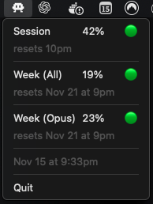

# Claude Code Monitor

<p align="center">
  
</p>

<p align="center">
  A macOS menu bar application that monitors and displays Claude Code CLI usage statistics directly in your menubar.
</p>

## Screenshot

<p align="center">
  
</p>

## Features

- Displays usage statistics in menubar dropdown with visual indicators
- Shows Session, Week (All), and Week (Sonnet) usage percentages
- **Dynamic menu bar icon** that changes color based on session usage:
  - Green icon (0-50%): Safe usage level
  - Yellow icon (51-85%): Moderate usage
  - Red icon (86-100%): High usage, approaching limit
- Color-coded emoji indicators in menu (🟢 0-50%, 🟡 51-85%, 🔴 86-100%)
- Displays reset times for each metric
- **Automatic update checker** - notifies when a new version is available on GitHub
- **Configurable auto-update** with customizable intervals (1m, 5m, 10m, 30m, 60m) or disabled
- **Manual "Update Now" button** with visual feedback
- **Settings menu** for easy configuration
- **Smart model detection** - automatically shows Sonnet or Opus section based on your plan
- Menubar-only app (does not appear in Dock)
- Auto-installs dependencies (jq, expect)
- Auto-configures directory trust
- Auto-detects Claude CLI location (including NVM installations)
- Saves detailed logs to `~/.claude-code-monitor/`
- Persistent settings stored in `~/.claude-code-monitor/config.json`
- Supports both Intel and Apple Silicon Macs
- Lightweight and runs in background

## Requirements

- macOS (Intel or Apple Silicon)
- [Claude Code CLI](https://code.claude.com/) installed and configured
- Homebrew (for auto-installing dependencies)
- Go 1.16+ (for building from source)

Note: The app will automatically install `jq` and `expect` via Homebrew if not found, and will auto-detect Claude CLI location even in NVM installations.

## Installation

### For End Users (Recommended)

**Installation Steps:**

1. Download `ClaudeCodeMonitor-1.1.0.dmg` from releases
2. Double-click the DMG file to open it
3. Drag `ClaudeCodeMonitor.app` to the Applications folder
4. Eject the DMG
5. Try to open ClaudeCodeMonitor from Applications
   - **You will see a security warning** - this is expected (see below)
6. Go to **System Settings** > **Privacy & Security**
7. Scroll down to the **Security** section
8. Click **"Open Anyway"** next to the message about ClaudeCodeMonitor
9. Click **"Open"** in the confirmation dialog
10. The app icon will appear in your menubar

**Why the security warning?**

This app is not signed with an Apple Developer certificate (which costs $99/year). macOS will show a warning saying it "can't be opened because Apple cannot check it for malicious software."

**This is expected and safe** - you can review the complete source code in this repository to verify there's no malware.

**Installation Tutorial:**


Note: The DMG includes a universal binary that works on both Intel and Apple Silicon Macs.

### For Developers

#### Generate DMG Installer for Distribution (Recommended)

```bash
git clone https://github.com/ribeirogab/claude-code-monitor.git
cd claude-code-monitor
make dmg-universal
```

This creates `dist/ClaudeCodeMonitor-1.1.0.dmg` with a universal binary (Intel + Apple Silicon).

#### Generate .app Bundle Only

```bash
make app          # Current architecture only
make app-intel    # Intel only
make app-universal # Universal binary
```

#### Install from Source

```bash
make install
```

This installs the binary to `/usr/local/bin/`.

#### Build for Specific Architectures

```bash
# Current architecture
make build

# Intel only
make build-intel

# Apple Silicon only
make build-arm
```

Note: Cross-compilation requires CGO toolchains. Use `make app` to build for current architecture.

## Usage

1. Start the application by opening `ClaudeCodeMonitor.app`
2. A small icon will appear in your macOS menu bar (color changes based on usage)
3. Click the icon to see current usage statistics:
   - Session usage with percentage and emoji indicator
   - Week (All models) usage
   - Week (Sonnet) usage (or Week (Opus) for older CLI versions)
   - Reset times for each metric
   - Last update timestamp
   - "Update Available" notification when a new version is released
4. Use the "Update Now" button to manually refresh usage data
5. Click "Update Available" to open the GitHub releases page (when shown)
6. Configure auto-update settings via **Settings > Auto-Update**:
   - **Disabled** - No automatic updates (manual only)
   - **1 minute** - Update every minute
   - **5 minutes** - Update every 5 minutes
   - **10 minutes** - Update every 10 minutes
   - **30 minutes** - Update every 30 minutes (default)
   - **60 minutes** - Update every hour
7. Usage data is also saved to `~/.claude-code-monitor/`:
   - `config.json` - User settings (auto-update preferences)
   - `claude-code-usage.json` - Parsed usage statistics
   - `claude-code-usage.log` - Raw output from monitoring script
   - `claude-code-usage-execution.log` - Execution timestamps and logs
   - `monitor.log` - Application logs
8. Click the menu bar icon and select "Quit" to stop the application

### Visual Indicators

The app uses two types of visual indicators:

**Menu Bar Icon** (changes based on session usage):
- Green icon (0-50%): Safe usage level
- Yellow icon (51-85%): Moderate usage
- Red icon (86-100%): High usage, approaching limit

**Menu Emojis** (shown next to each percentage):
- 🟢 Green (0-50%): Safe usage level
- 🟡 Yellow (51-85%): Moderate usage
- 🔴 Red (86-100%): High usage, approaching limit

## Output Format

The `claude-code-usage.json` file contains:

```json
{
  "session_percent": 40,
  "session_reset": "10pm (America/Sao_Paulo)",
  "week_all_percent": 19,
  "week_all_reset": "Nov 21 at 9pm (America/Sao_Paulo)",
  "week_opus_percent": 0,
  "week_opus_reset": "",
  "week_sonnet_percent": 23,
  "week_sonnet_reset": "Nov 21 at 9pm (America/Sao_Paulo)",
  "timestamp": "2025-11-16T00:26:20Z"
}
```

Note: `week_opus_*` fields are for backward compatibility with older Claude CLI versions. Newer versions use `week_sonnet_*` fields.

## Development

Run in development mode:

```bash
make run  # Run with go run (no build)
make dev  # Build and execute binary (clean build, no cache)
```

Clean build artifacts:

```bash
make clean
```

Show all available commands:

```bash
make help
```

## Project Structure

```plaintext
.
├── cmd/
│   └── monitor/          # Main application entry point
│       └── main.go
├── internal/
│   ├── config/           # Configuration management
│   │   └── config.go
│   ├── executor/         # Script execution logic
│   │   └── executor.go
│   ├── scheduler/        # Periodic task scheduling
│   │   └── scheduler.go
│   └── updater/          # GitHub update checker
│       ├── github.go     # GitHub API client
│       ├── updater.go    # Update logic
│       └── version.go    # Semantic version parsing
├── assets/
│   └── icons/            # Menu bar icons (green, yellow, red)
├── claude-code-usage.sh  # Monitoring script
├── Makefile              # Build automation
├── go.mod                # Go module definition
└── README.md             # This file
```

## How It Works

1. The application runs as a menubar-only app using `systray`
2. On startup, it:
   - Loads user configuration from `~/.claude-code-monitor/config.json`
   - Loads menubar icon from assets
   - Creates menu items for displaying usage stats
   - Detects Sonnet/Opus access and conditionally shows the appropriate section
   - Starts a scheduler with configurable interval (default: 30 minutes, disabled by default)
   - Starts the update checker (checks GitHub releases every hour)
3. The scheduler executes `claude-code-usage.sh` which:
   - Auto-installs `jq` and `expect` via Homebrew if not found
   - Pre-configures directory trust in `~/.claude.json` to bypass security prompts
   - Auto-detects Claude CLI location (supports standard paths and NVM installations)
   - Launches Claude Code CLI using `expect`
   - Captures the `/usage` command output
   - Parses usage percentages and reset times (supports both Sonnet and Opus formats)
   - Generates JSON output with timestamp
4. After successful execution:
   - The menubar display updates automatically
   - The menu bar icon changes color based on session usage (green/yellow/red)
5. Users can manually trigger updates via "Update Now" button
6. When a new version is detected, "Update Available" menu item appears
7. Settings are persisted and loaded on next startup

## Troubleshooting

**Application doesn't start:**

- Check that Claude Code CLI is installed and accessible: `which claude`
- Verify Homebrew is installed (for auto-installing jq): `which brew`
- Check application logs in `~/.claude-code-monitor/monitor.log`

**Application won't quit:**

If the app doesn't close properly (e.g., when a script is running), force quit it:

```bash
killall claude-code-monitor
```

**No data being generated:**

- Verify that Claude Code CLI is properly configured
- Check logs in `~/.claude-code-monitor/claude-code-usage-execution.log`
- If using NVM, ensure Node.js is properly installed
- Verify Homebrew is working: `brew --version`

**Menu not updating:**

- Check if JSON file is being updated: `cat ~/.claude-code-monitor/claude-code-usage.json`
- View execution logs: `tail -f ~/.claude-code-monitor/claude-code-usage-execution.log`
- Restart the application

**Menu bar icon not showing:**

- Check if icon file exists in the app bundle
- The app will show "claude-code" as title text if icon is not found
- The app is still running - check Activity Monitor for `claude-code-monitor`

**Trust dialog appearing:**

- This should be auto-handled by the script
- If it persists, manually trust the directory in Claude Code CLI
- Check if `~/.claude.json` has the correct permissions

## License

MIT License - see [LICENSE](LICENSE) file for details
